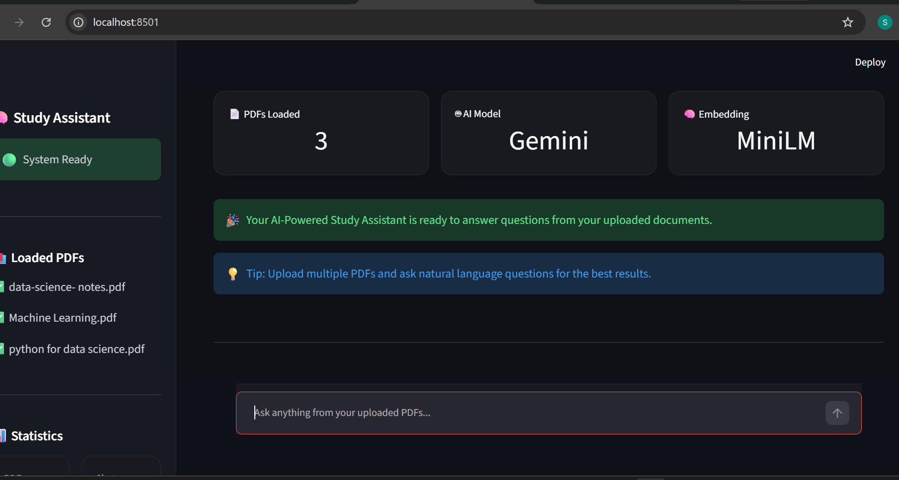
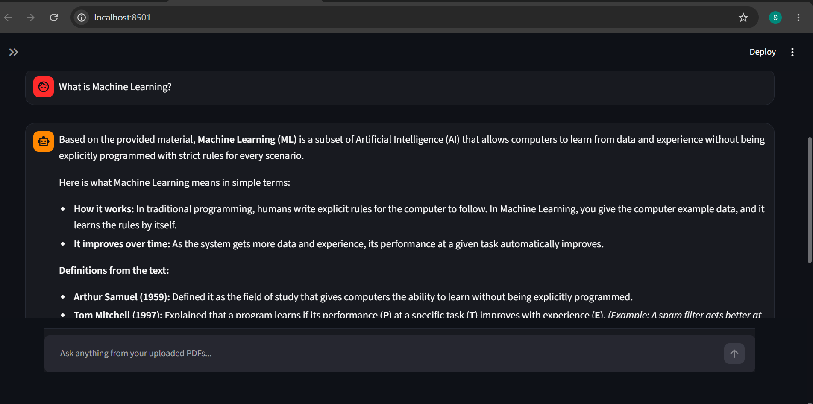
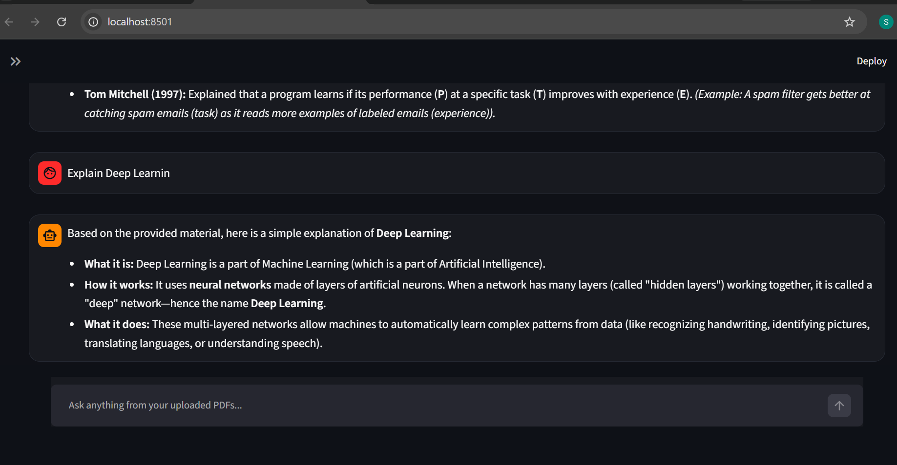

# 📚 AI-Powered Study Assistant using RAG

An AI-powered Study Assistant built using **Google Gemini**, **LlamaIndex**, **HuggingFace Embeddings**, and **Streamlit**. The application allows students to upload study materials in PDF format and ask questions in natural language. It retrieves relevant content from the uploaded documents using Retrieval-Augmented Generation (RAG) and generates accurate answers.

---

## 🚀 Features

- 📄 Supports Multiple PDF Documents
- 🤖 Google Gemini LLM Integration
- 🧠 HuggingFace MiniLM Embeddings
- 🔍 Semantic Search using LlamaIndex
- 📚 Retrieval-Augmented Generation (RAG)
- 💬 Interactive Chat Interface
- 🎨 Modern Streamlit Dashboard
- ⚡ Fast and Accurate Question Answering

---

## 🛠️ Technologies Used

| Technology | Purpose |
|------------|---------|
| Python | Programming Language |
| Streamlit | Web Application |
| Google Gemini | Large Language Model |
| LlamaIndex | RAG Framework |
| HuggingFace MiniLM | Text Embeddings |
| PyMuPDF | PDF Processing |
| dotenv | Environment Variable Management |

---

## 📂 Project Structure

```text
AI-Powered-Study-Assistant-RAG/
│
├── data/
│   ├── Machine Learning.pdf
│   ├── Python for Data Science.pdf
│   └── Data Science.pdf
│
├── screenshots/
│   ├── clear.png
│   ├── homepage1.png
│   ├── homepage2.png
│   └── question1.png
     
│
├── app.py
├── config.py
├── document_loader.py
├── embedding_model.py
├── llm_model.py
├── prompts.py
├── query_engine.py
├── rag_pipeline.py
├── requirements.txt
├── README.md
└── .gitignore
```

---

# 📸 Application Screenshots

## 🏠 Home Dashboard



```text
screenshots/home.png
```

---

## 💬 Chat Interface




---

## 🤖 AI Generated Answer




---

## ⚙️ Installation


### Open Project

```bash
cd AI-Powered-Study-Assistant-RAG
```

### Create Virtual Environment

```bash
python -m venv venv
```

### Activate Virtual Environment

Windows

```bash
venv\Scripts\activate
```

Linux / macOS

```bash
source venv/bin/activate
```

### Install Dependencies

```bash
pip install -r requirements.txt
```

---

## 🔑 API Configuration

Create a **.env** file inside the project folder.

```env
GOOGLE_API_KEY=YOUR_GEMINI_API_KEY
```

---

## ▶️ Run the Project

```bash
streamlit run app.py
```

Open the application in your browser.

---

## 📖 How to Use

1. Place your PDF documents inside the **data** folder.
2. Run the Streamlit application.
3. Ask questions related to the uploaded study materials.
4. The system retrieves relevant content and generates answers using Gemini.

---

## 🎯 Future Improvements

- 📤 Upload PDF directly from UI
- 🌙 Light and Dark Theme Support
- 📖 Source Citation Display
- 🔊 Voice-based Question Answering
- 💾 Persistent Chat History
- 🌐 Online Document Support

---

## 👩‍💻 Developer

**Shruti Deshmukh**

MCA Student | Data Science Enthusiast

---

## 📄 License

This project is developed for educational and learning purposes.

---

⭐ If you found this project useful, please consider giving it a **Star** on GitHub.